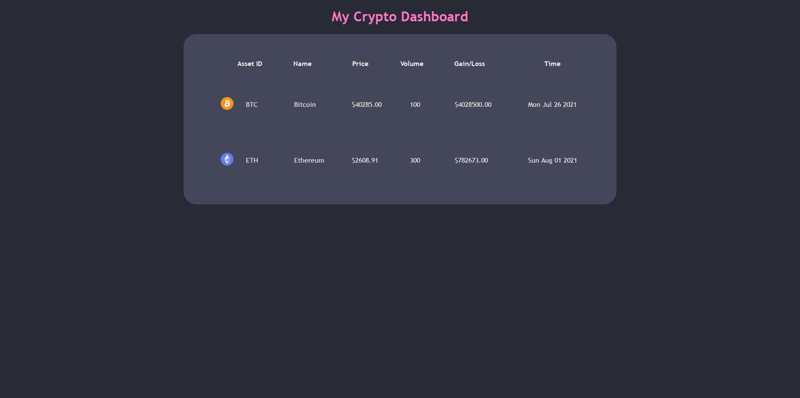

# GraphQL Federation Crypto App

## Objective
This app was created in order to study **Apollo Federation** for GraphQL APIs. 

A federated database will combine GraphQL APIs from multiple microservices making querying and fetching them in the main app possible.

The aim of the project was to federate two databases: deals and coins.

## Technologies

### Backend:

- Apollo
- Astra
- GraphQL
- Microsoft  Azure
- Nodemon

### Fronted 

- CSS
- ReactJS

## Screenshot

